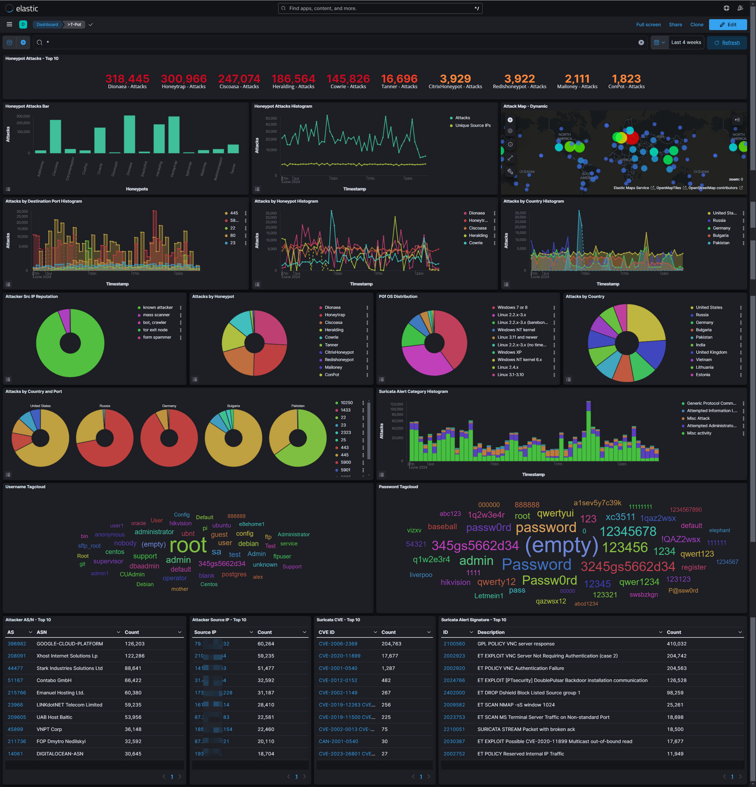

# Project: HoneyNet and DFIR

## Project Overview
This project involves the deployment of honeypots to collect malware files and monitor hacker activities. The data gathered from these honeypots are analyzed in the Digital Forensic Lab within the Digital Forensics and Incident Response (DFIR) framework. Additionally, hacking patterns identified in the Penetration Testing lab are studied in the Digital Forensic Lab.

## Findings and Studies

### T-Pot Honeypot Deployment

We have deployed the T-Pot honeypot on a cloud platform to collect malware files and monitor hacker activities. The following screenshot provides an overview of the top 10 attacks, attack map, attackers' OS distribution, attackers by country, username and password tag cloud, attackers' autonomous systems (AS) and source IPs, detected Common Vulnerabilities and Exposures (CVEs), and Suricata IDS alerts over the past 4 weeks.

    

### T-Pot Honeypot Usage

Watch the video below to learn how to use the T-Pot honeypot to collect malware files and monitor hacker activities.
[(https://www.youtube.com/watch?v=918dgVJLqgU)

### Hacker Activities and Keystroke Analysis

A total of 6,420 hacker keystroke sessions have been recorded following their break-ins, encompassing 133,694 lines of keystrokes. The common activities performed by hackers after breaking into systems include:

- **Probing Victim Host Information:** Gathering details such as IP address, OS version, installed software, CPU, memory, and disk size.
- **Enabling All Services:** Activating all services on the victim host.
- **Modifying Credentials:** Changing the root password or creating other root accounts.
- **Downloading Files:** Using tools like `wget`, `ftp`, or `curl` to download files and attempting to execute them.
- **Creating Binary Files:** Using echo hex code to create binary files and attempting to execute them.
- **Installing Trojan Programs:** Installing trojan horse programs.
- **Establishing Backdoors:** Appending public keys to the `authorized_keys` file for SSH access.
- **Setting Up Proxy Servers:** Configuring IRC proxies, botnet command and control channels.
- **Running DDoS Attacks:** Conducting Distributed Denial of Service (DDoS) attacks.
- **Mining Cryptocurrency:** Running cryptocurrency mining operations.

